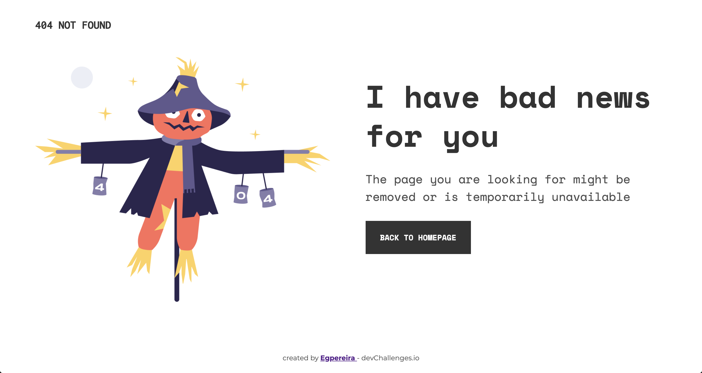

<h1 align="center">404 Not Found</h1>

   Solution for a challenge from  <a href="http://devchallenges.io" target="_blank">Devchallenges.io</a>.

  <h3>
    <a href="https://egpereira-devchallenge-01.netlify.app/">
      Demo
    </a>
     | 
    <a href="https://github.com/Egpereira/404-not-found">
      Solution
    </a>
     | 
    <a href="https://devchallenges.io/challenges/wBunSb7FPrIepJZAg0sY">
      Challenge
    </a>
  </h3>

## Overview

In [this project](https://egpereira-devchallenge-01.netlify.app/) I had to replicate a simple not found page based on the given design. The major challenge was to get the responsive layout working as I wanted on different screen sizes, since the provided layout only had two screen size specifications.

Aiming to exercise building sites with accessibility in mind, I tried my best to use the correct HTML tags for each of the components and made some personal changes on the used colors to make sure they all reached the minimum contrast level of the [WCAG Contrast (Enhanced)](https://www.w3.org/WAI/WCAG21/Understanding/contrast-enhanced) success criterion. The [WCAG Focus Appearance (Enhanced)](https://w3c.github.io/wcag/understanding/focus-appearance-enhanced) success criterion was also considered when developing the focus of clickable elements.

### Built With

- HTML
- CSS
- [Netlify](https://www.netlify.com/)

## Features

This application/site was created as a submission to a [DevChallenges](https://devchallenges.io/challenges) challenge. The [challenge](https://devchallenges.io/challenges/wBunSb7FPrIepJZAg0sY) was to build an application to complete the given user stories.

**User story**: I can see a page following the given design

## Contact

- [GitHub](https://github.com/Egpereira)
- [Email](mailto:egpereira05@gmail.com)
